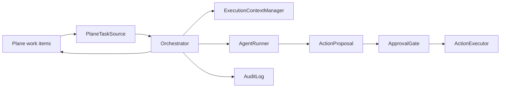

# Architecture

This implementation keeps the useful parts of Symphony while widening the task model beyond
coding work.

## Components



## Lifecycle

1. Plane work item is assigned to the agent and labeled `agent-ready`.
2. The orchestrator polls Plane and normalizes the work item into a `Task`.
3. The task is claimed by moving Plane state to `In Progress` and writing a comment.
4. An isolated execution context is created under `.symphony/workspaces/<task-id>`.
5. A runner produces either a completed result or one or more action proposals.
6. Proposals that need approval move the Plane item to `Needs Human`.
7. Once a human moves the Plane item to `Human Approved`, the action executor performs the
   approved action and records an audit event.
8. Completed coding handoff moves the work item to `In Review`; approved external-action
   completion moves it to `Done`.

## Why Approval Is Separate From Execution

General-purpose tasks often include side effects outside the repository: email, publishing,
SaaS updates, form submission, payments, or customer-visible communication. Those should be
modeled as proposed actions, not hidden runner behavior. This keeps the agent useful while
preserving a human decision point.

## First-Version Boundaries

- Polling is supported; webhooks can be added later.
- A foreground daemon wraps polling with interval sleeps, JSONL logs, failure backoff, and
  SIGINT/SIGTERM shutdown.
- The Plane adapter writes comments and states, not custom fields by default.
- The default runner is proposal-only and deterministic for tests.
- The optional Codex runner shells out to the local `codex exec` CLI and stores prompt,
  stdout, stderr, and the final message in the task execution context.
- The action executor defaults to dry-run.
- The audit log is JSONL so it can be inspected, replayed, or shipped elsewhere.

## Self-Hosted Plane Testing

Use the project named `test project` for smoke tests. The CLI discovers the project by name,
checks states and labels, and can run a dry orchestration pass without mutations:

```bash
python3 -m symphony_general.cli plane-smoke --project-name "test project"
python3 -m symphony_general.cli poll-once --project-name "test project" --dry-run
python3 -m symphony_general.cli run-daemon --project-name "test project" --interval-seconds 30
```

The Plane API configuration is read from:

- `PLANE_BASE_URL`
- `PLANE_API_KEY`
- `PLANE_WORKSPACE_SLUG`

No Plane secrets should be committed.
